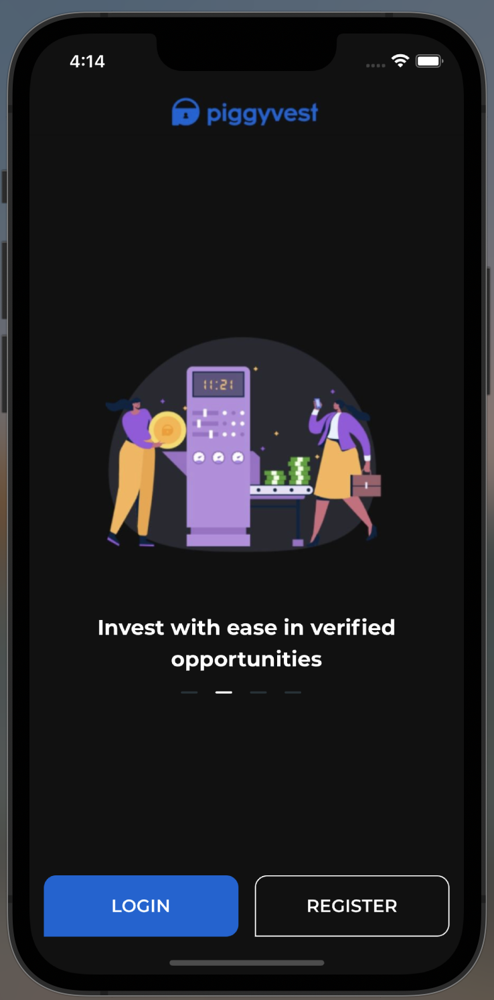
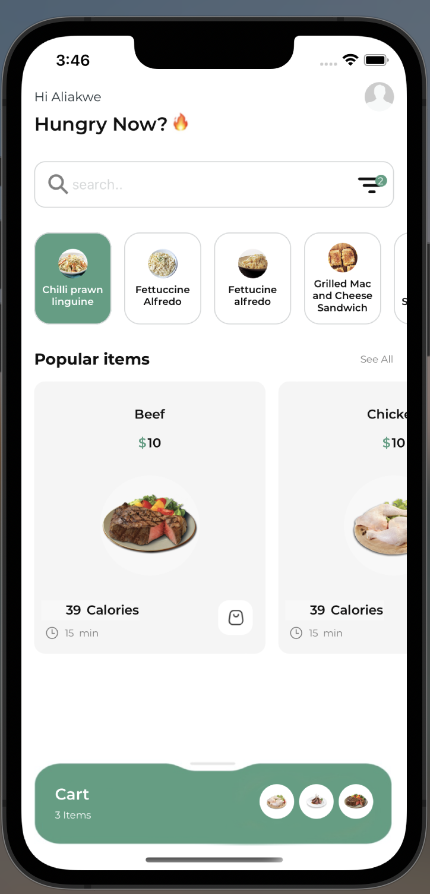
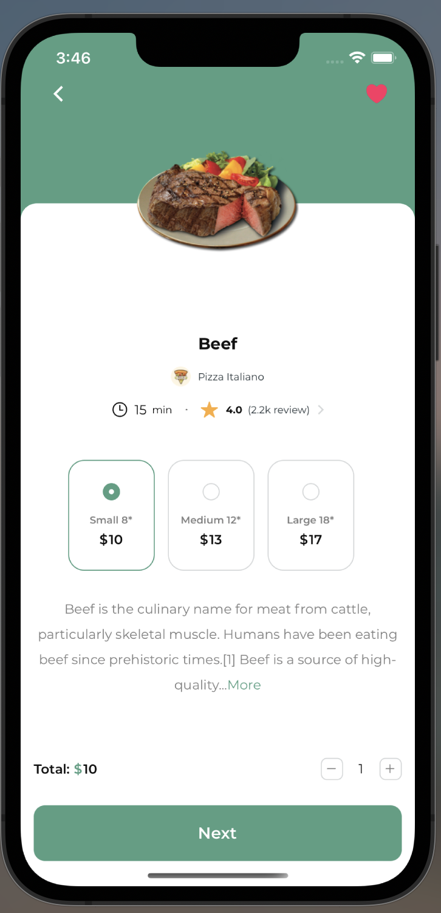
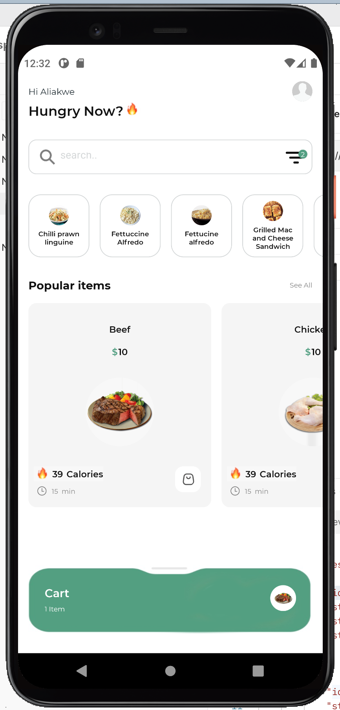
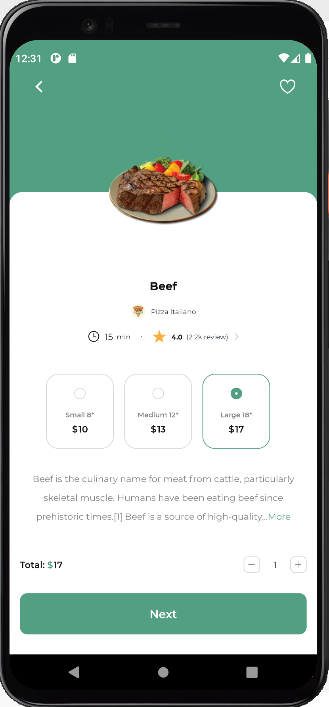

first run yarn install
 
cd ios pod install
 
to run metro bundler: yarn-start --reset-cache
 
to run on ios: yarn-start run-ios
 
to run on android: yarn-start run-android
 
to test: yarn jest
 
 

Features:
 
Onboarding screen
 
.Implment auto sliding onboarding screen
 

Home screen
 
.User can search from categories
 
.Uses can click on a mean and the meal would be highlighted
 
.Users can see all product added to carts

 
Product Details screen 
 
.User can click on the like icon to add to cart or delete from cart depending on if the product has been previously added to cart
 
.User can click on item sizes and increment or decrement the product count

 
IOS SCREENSHOTS

 

 

 

ANDROID SCREENSHOTS

 

